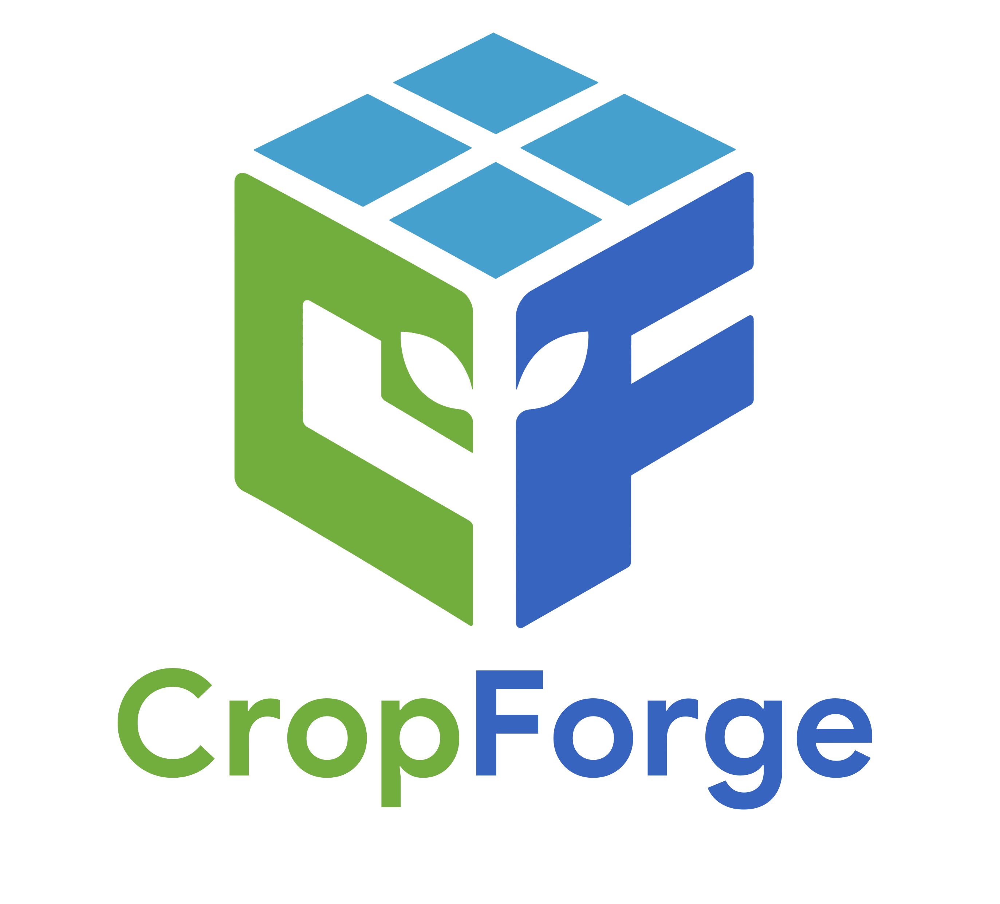

# CropForge

<p align="center">
  
</p>

[](https://badge.fury.io/py/cropforge)
[](https://github.com/saswatsundar123/cropforge/actions)
[](https://cropforge.readthedocs.io)
[](LICENSE)

CropForge lets you define a crop simulation entirely in Python. You write the model equations; CropForge handles time-stepping, spatial state management, terrain physics, sediment dynamics, Parquet logging, and a WebGL 3D dashboard.

```bash
pip install cropforge
```

---

## What's New in v1.0.0 - Community Release

v1.0.0 adds opt-in Weed Competition, Planting Density and `yield_summary()`,
Irrigation Animation, a Yield Metrics dashboard panel, citation metadata,
Zenodo metadata, issue templates, and community contribution governance.

> Intercropping is intentionally deferred to v1.1.0 so the v1.0.0 API can stay
> stable for publication and early adopters.

---

## What's New in v0.9.5 - Visual Architecture Complete

v0.9.5 completes CropForge's visual architecture arc with First-Party Asset Bundles, Machinery Animation, Stress/Disease Visualizations, enhanced-mode rain particles, PBR rendering, morph targets, and terrain-aware GLB export.

> Open-source, code-first virtual farm runtime for agricultural researchers.

## What's New in v0.9.0 — Photorealistic PBR Rendering & GLTF Export

v0.9.0 closes the visual arc: the simulation now renders with photorealistic PBR materials, exports full 3D scenes as industry-standard `.glb` files, and resolves plants to registered GLTF stage models.

### Photorealistic PBR Rendering

```python
farm.run(days=90)
farm.visualize(quality="enhanced")   # MeshStandardMaterial, shadows, sun-angle light
farm.visualize()                     # quality="standard" — identical to v0.8.0
```

### Plant Stage Architecture & Model Registry

```python
from cropforge.models import ModelRegistry

ModelRegistry.register(
    species="Triticum aestivum",
    stage=4,
    gltf_path="models/wheat_heading.glb",
)
# Cylinder fallback automatic if no model registered
```

### GLTF Scene Export — Blender / Unreal Engine Ready

```python
farm.run(days=90)
farm.export_scene(day=45, filepath="output/farm_day45.glb")
# pip install cropforge[export]  required
```

The dashboard also provides a one-click **Export 3D Scene (.glb)** button.

### High-Resolution Plotly Terrain

The 3D terrain panel now applies 4× bicubic upsampling (`scipy.ndimage.zoom`) before display. Physics data is never modified — this is a pure UI enhancement.

---

## What's New in v0.8.0 — Terrain Arc Completion

v0.8.0 closes the terrain arc begun in v0.6.0: the simulation engine now operates at arbitrary sub-metre spatial resolution, sediment moves physically across the landscape, and the 3D renderer stays performant at field scales.

### Sub-Metre Resolution

```python
terrain = Terrain.procedural(rows=200, cols=200, resolution_m=0.25)
# All engines (runoff, LS factor, D8 routing, nutrient flux) scale correctly
# resolution_m=1.0 default → zero change to all prior scripts
```

### Sediment Dynamics & Mass Conservation

```python
farm.use_physics(erosion=True, sediment_transport=True)
# Every gram eroded is either deposited downslope or exits the field boundary.
# SoilState gains: sediment_flux_kg_m2, sediment_deposited_kg_m2,
#                  cumulative_sediment_loss_kg_m2, cumulative_deposition_kg_m2
```

### Geomorphological Feedback

The terrain elevation grid updates daily from net sediment flux. Slope and aspect recompute automatically for the next day's D8 routing. Layer 0 topsoil expands and contracts in response.

### Advanced Conservation Land Management

```python
from cropforge import TiedRidges, VegetativeFilterStrip

field.set_land_prep(TiedRidges(
    ridge_height_m=0.20, ridge_spacing_m=2.0,
    tie_spacing_m=6.0,   tie_height_m=0.12,
))
# Periodic tie-dams block D8 flow, forming micro-catchments.
# Proved: cumulative erosion < plain RidgeFurrow.

field.set_land_prep(VegetativeFilterStrip(
    strip_width_m=3.0, n_strip_rows=3, position="downslope"
))
# Per-cell roughness=0.95 → 95% reduction in soil detachment at strip rows.
```

### LOD 3D Rendering — 500×500 Fields at 60 fps

The Three.js renderer now chunks terrain into 64×64-cell tiles. Distant chunks automatically downgrade to 1/16th vertex count. For a 500×500 sub-metre field:

| State | Vertices | vs. monolithic |
|---|---|---|
| All close (hi-res) | 270,400 | baseline |
| All distant (lo-res) | 18,496 | **14× fewer** |

---

## Quick Start

```python
from cropforge import Farm, Field, Crop, Soil, Weather, Terrain
from cropforge.plugins import StandardWheat

farm  = Farm(name="MyFarm", location=(28.6, 77.2))
field = Field(name="Plot A", rows=20, cols=30, area_ha=2.4)
field.set_crop(Crop(species="wheat"))
field.set_weather(Weather.from_csv("data/weather.csv"))
field.set_soil(Soil.from_csv("data/soil.csv", apply="uniform"))
field.set_terrain(Terrain.procedural(rows=20, cols=30, resolution_m=0.5))
farm.add_field(field)

field.use_plugin(StandardWheat)
farm.use_physics(
    et0=True, radiation=True, erosion=True, sediment_transport=True,
    slope_radiation_correction=True,
)

farm.run(days=90)
farm.visualize()
```

See `examples/digital_twin_full_lifecycle.py` for the complete visual capstone example.
See `examples/photorealistic_twin_trial.py` for the v0.9.0 visual export example.
See `examples/conservation_ag_trial.py` and `examples/submetre_performance_trial.py` for v0.8.0 examples.

---

## What's New in v0.7.0

- **Solar Incidence Engine:** slope-aspect radiation correction.
- **Wind Shadow Engine:** terrain-modulated wind fields.
- **Clod Dynamics:** exponential roughness decay under rainfall.
- **Topographical Erosion:** RUSLE model on the 3D terrain.

## What's New in v0.6.0

- **Terrain Engine:** procedural, CSV, and GeoTIFF topographies.
- **Land Preparation Modifiers:** `RidgeFurrow`, `ContourBund`, `Terrace`, `DeepTillage`, `ConservationTillage`.
- **D8 Hydrology Coupling:** lateral water and nutrient routing over terrain.
- **3D Dashboard Modal:** WebGL terrain viewer with agronomic variable overlays.

## What's New in v0.5.0 – v0.4.0

- **Plugin Ecosystem:** `StandardWheat`, `StandardMaize`.
- **Multi-Season Rotations:** soil state carries over between runs.
- **Compare Dashboard:** side-by-side farm comparisons, CSV export.
- **Opt-In Physics:** FAO-56 ET0, Beer-Lambert radiation, SIR disease spread.

---

## Documentation

Full documentation at [cropforge.readthedocs.io](https://cropforge.readthedocs.io).

## Citing CropForge

If you use CropForge in academic work, please cite the software. The repository
includes `CITATION.cff`, which GitHub and Zenodo can read directly.

JOSS-style software citation:

> Rath, S. S. (2026). CropForge: A Python-first virtual farm runtime for crop
> simulation, spatial physics, and 3D agronomic digital twins. Version 1.0.0.
> https://github.com/saswatsundar123/cropforge

BibTeX:

```bibtex
@software{rath_2026_cropforge,
  author  = {Rath, Saswat Sundar},
  title   = {CropForge},
  version = {1.0.0},
  year    = {2026},
  url     = {https://github.com/saswatsundar123/cropforge},
  license = {MIT}
}
```

## Licence

MIT — Saswat Sundar Rath, ICAR-IARI Jharkhand, 2026
